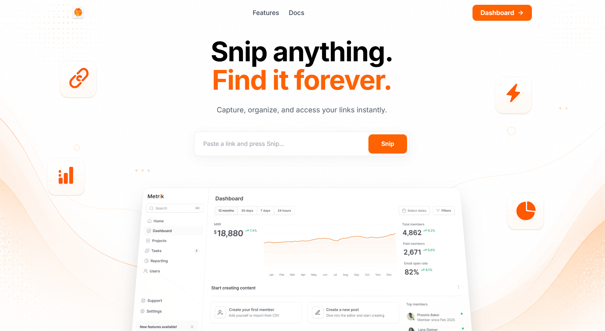
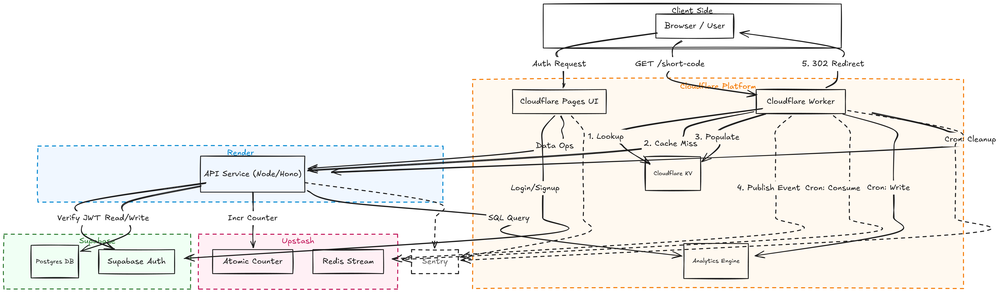

**[Readme](./Readme.md)** | **[System Design](./system_design.md)** | **[Initial Design](./Intial_design.md)**


# Snip

A production-ready URL shortener with edge redirects and real-time analytics.


<!-- Replace with a real screenshot/banner of the dashboard -->


## Features

- Create short links with optional custom aliases and expiration dates
- Fast redirects served from Cloudflare's edge network, with origin fallback
- Per-link analytics: total clicks, clicks over time, top countries,
  referrers, and devices
- Account-wide dashboard: totals, trends, and top-performing links
- Error tracking across every service via Sentry


## Architecture




For the full reasoning behind these choices  why Redis Streams instead of
Kafka, why Analytics Engine instead of ClickHouse, the free-tier tradeoffs,
CAP considerations, and everything cut from the original design  see
[`system_design.md`](./system_design.md).


## Tech stack

| Layer | Technology |
|---|---|
| Frontend | Next.js, deployed on Cloudflare Pages |
| API | Hono (Node), deployed on Render |
| Edge / redirects | Hono, deployed as a Cloudflare Worker |
| Database | Postgres (Supabase), via Drizzle ORM |
| Auth | Supabase Auth |
| Cache + counter | Upstash Redis |
| Analytics pipeline | Redis Streams → Cloudflare Cron Trigger → Cloudflare Analytics Engine |
| Error tracking | Sentry |

## Project structure

```
/apps/web        Next.js dashboard
/apps/api        API — auth, URL creation, analytics queries
/apps/edge       Cloudflare Worker — redirects + scheduled analytics processing
/packages/db     Drizzle schema, shared across apps
/packages/shared Shared TypeScript types
```

## Getting started

Follow these steps to run the complete stack locally:

### 1. Installation
Clone the repository and install all dependencies using pnpm:
```bash
git clone https://github.com/your-username/snip.git
cd snip
pnpm install
```

### 2. Environment Variables
You'll need to set up environment variables for each application in the monorepo.
Copy the `.env.example` file to `.env` in the root and inside each app directory:
- `/apps/api/.env`
- `/apps/edge/.env`
- `/apps/web/.env`

*(See `setup.md` for a detailed guide on how to obtain credentials for Supabase, Upstash Redis, and Cloudflare).*

### 3. Run Locally
Start all development servers. You can run these commands from the root directory:

```bash
# Start the backend API (Render)
pnpm --filter api dev

# Start the frontend dashboard (Next.js)
pnpm --filter web dev

# Start the edge redirect worker (Cloudflare)
pnpm --filter edge dev
```

## Deployment

Deploys are handled manually per-service to maintain full control over the infrastructure (see `system_design.md` for the reasoning behind this scope decision):

- **API (`/apps/api`)**: Deployed on Render. Redeploy directly from the Render dashboard.
- **Edge Worker (`/apps/edge`)**: Deployed to Cloudflare. Run `pnpm --filter edge deploy` from the root directory.
- **Dashboard (`/apps/web`)**: Deployed on Cloudflare Pages. Automatically deploys when you push to the `main` branch.


## License

MIT