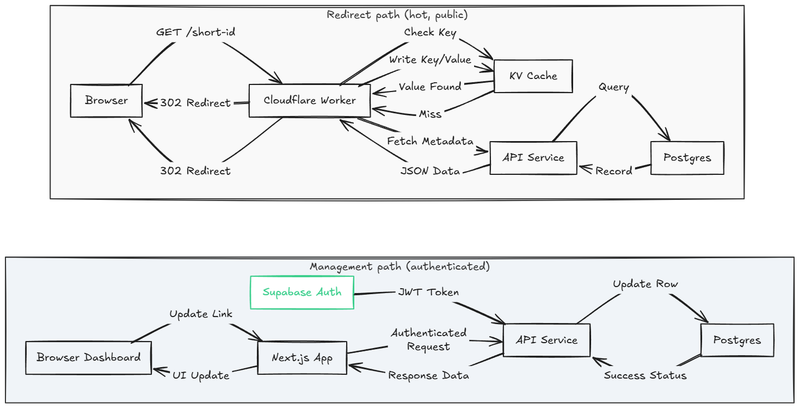
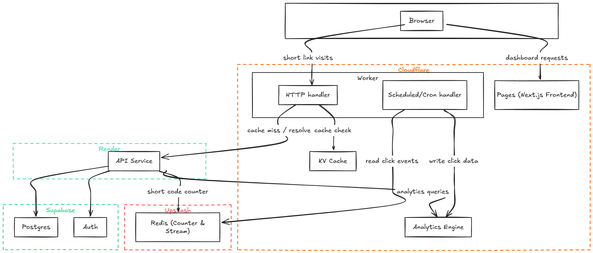

**[Readme](./Readme.md)** | **[System Design](./system_design.md)** | **[Initial Design](./Intial_design.md)**

---

# System Design — Snip

This document walks through how Snip was actually designed, the tradeoffs
made along the way, and what I'd do differently with a real budget and a
real team. 


## 1. Functional requirements

**Must have:**
- A user can submit a long URL and get back a short one.
- Optionally attach a custom alias instead of a generated code.
- Optionally set an expiration date.
- Anyone (no auth needed) can visit a short URL and get redirected to the
  original.
- The link owner can see analytics: total clicks, clicks over time, top
  countries, top referrers, top devices, and their best-performing links.

**Explicitly out of scope:**
- Spam/malicious link detection.
- Real-time (sub-minute) analytics — a few minutes of lag is fine.
- Billing, teams, multi-tenant permissions — this is a single-user tool per
  account, not a SaaS product.

## 2. Non-functional requirements

- Redirects should feel instant. Not "instant" in the sense of a formal SLA - there's no on-call rotation here - but the architecture should be one
  where a real production version of this would hit sub-100ms redirects.
- Short codes must never collide. This one isn't negotiable regardless of
  scale - a wrong redirect is worse than a slow one.
- Reads (redirects) vastly outnumber writes (link creation) - this shapes
  almost every caching decision below.
- Availability over strict consistency. If someone's link takes a few
  seconds to become clickable after creation, that's fine. If two people
  somehow get assigned the same short code, that's not.
- Cost: **$0.** Not "cheap" - actually free. This shaped more decisions
  here than any other requirement, and I'll flag every place it did.


## 3. Core entities

Kept deliberately small:

- **User** - not modeled by me at all. Supabase Auth owns this table entirely; I just reference its `id`.
- **Url** - the actual short link record: short code, the long URL, an
  optional custom alias, an optional expiration date, who owns it, when it
  was created.
- **ClickEvent** - not a persisted row in my own database at all (more on
  this in the deep dives) — it's a transient event that flows through Redis
  and lands as a data point in Cloudflare's Analytics Engine, not as a row
  I query with SQL.

I thought about adding a `Domain` entity (for custom domains per user) and
a `Click` table with full click-level detail queryable via normal SQL, but
both would have added real schema complexity for a feature nobody but me
would ever use. Cut both.


## 4. The API

Mapped close to 1:1 with the functional requirements, plus a couple of
internal-only endpoints that exist purely to support the architecture (not
things a user ever calls directly).

**Public, user-facing:**
```
POST /urls                  create a short URL
GET  /urls                  list the authenticated user's URLs
PATCH /urls/:short_code      edit a custom alias
DELETE /urls/:short_code     delete a URL
PATCH /urls/:short_code/favorite   toggle favorite

GET /analytics/:short_code/summary   per-link stats
GET /analytics/:short_code/daily     per-link time series
GET /analytics/summary               account-wide stats
GET /analytics/daily                 account-wide time series
GET /analytics/breakdown?by=country|referrer|device
GET /analytics/top-links
```

**Public, unauthenticated:**
```
GET /:short_code             the actual redirect — lives on the edge Worker, not the API
```

**Internal only (never called by the frontend):**
```
GET /resolve/:short_code     used by the edge Worker on a cache miss
```

Everything in the second and third groups exists because of a decision
made in the high-level design: the redirect path and the management path
are two genuinely different systems with different latency needs, so they
live in different places entirely.


## 5. High-level design

The system splits into two halves that barely touch each other: **the
redirect path** (public, unauthenticated, has to be fast) and **the
management/analytics path** (authenticated, can afford to be slower).




**Creating a short URL:**
The dashboard calls the API. The API checks the user's session against
Supabase Auth, validates the long URL, and then needs a short code. 

If the
user gave a custom alias, that's used directly (after a uniqueness check
at insert time, not before — more on why in the deep dive). Otherwise, the
API asks Redis for the next value from an atomic counter, base62-encodes
it, and that's the code. Either way, the row goes into Postgres, and

Postgres's own `UNIQUE` constraint is what actually guarantees no
collisions — everything before that is an optimization, not a guarantee.

**Visiting a short URL:**
This never touches the dashboard or even the main API in the common case.
A Cloudflare Worker handles it directly: check its edge KV cache first, and
if it's there, redirect immediately this request never leaves
Cloudflare's network. 

If it's not cached, the Worker calls a small internal
endpoint on the API (`/resolve/:short_code`), gets the answer, caches it in
KV for next time, and redirects. Either way, the Worker also drops a
"click happened" event onto a Redis Stream and moves on it does not wait
around for that to finish.

**Analytics:**
Separately, on a schedule (every few minutes), the same Worker wakes up
again not from a request this time, but from a Cloudflare Cron Trigger 
reads whatever click events piled up in the Redis Stream, and writes them
into Cloudflare's Analytics Engine. The dashboard's analytics pages query
Analytics Engine through the main API, which exposes a handful of
aggregation endpoints over it.


## Potential deep dives

### 1) How do we make sure short URLs are unique?

Two paths, same underlying guarantee:

- **Generated codes**: an atomic counter in Redis (`INCR`), base62-encoded.
  Redis is single-threaded, so two requests can never get the same counter
  value  that part is solved cleanly. To avoid hitting Redis on every
  single link creation, the API actually pulls a batch of values (say
  1,000) at a time and hands them out locally until they run out.
- **Custom aliases**: no counter involved at all  the user's chosen text
  becomes the code directly.

Here's the part that actually matters: **none of the above is what
guarantees uniqueness.** The real guarantee is a `UNIQUE` constraint on the
`short_code` column in Postgres.

 The counter avoids collisions in practice,
but it's not a proof if I ever ran this across multiple regions, or if
Redis and Postgres ever drifted, the counter alone could theoretically
produce a duplicate. The database catching that and rejecting the insert
is the actual correctness boundary. Everything upstream of that is there
to make collisions rare, not to make them impossible.

This matters even more for custom aliases, where there's no counter at
all  it would be tempting to just check "does this alias already exist?"
before inserting it, but that's a classic race condition: two requests can
both check, both see it's free, and both try to insert. The fix isn't a
smarter check, it's not relying on the check at all  attempt the insert
directly and let the database's constraint be the thing that fails if
there's a collision, then surface that as a normal "alias taken" error.

**If I had a real budget/team**, I probably wouldn't change this part much
it's already the right shape. What I'd add is multi-region counter
partitioning (give each region a disjoint block of the counter space) if
this ever needed to run in more than one place, which it doesn't right
now.

### 2) How do we make redirects fast?

This is a classic "cache in layers, closest to the user wins" problem, and
I built it as three layers that only get hit in order if the one before it
misses:

1. **Cloudflare KV**, sitting right in the edge Worker. If the short code
   is here, the redirect happens without ever leaving Cloudflare's network
   this is the fast path almost every real click takes once a link has
   been visited once.
2. **Upstash Redis**, one hop further in, checked only if KV misses. Still
   fast, still in-memory, but now it's a real network hop to Upstash
   instead of staying entirely at the edge.
3. **Postgres**, the actual source of truth, only touched if both caches
   miss — which in practice is basically "the first time anyone visits a
   brand-new link."

Each layer that hits populates the layer above it, so a link gets faster
every time it's clicked, not slower.

**The honest tradeoff here**: KV is eventually consistent across
Cloudflare's edge locations, meaning if I delete or edit a link, a stale
cached version could theoretically still serve for a short window
somewhere in the world. Given the non-functional requirement said
availability matters more than perfect consistency, this is fine  but
it's worth naming out loud rather than pretending the cache is perfectly
coherent.

**If I had a real budget/team**, this part genuinely wouldn't change much
this is close to how Bitly-scale systems actually work. The one addition
I'd make is a CDN-level rule to short-circuit even the Worker invocation
for extremely hot links, though at real scale the Worker itself is already
cheap enough that this is a marginal gain, not a necessary one.

### 3) How would this scale to 1B short URLs and 100M DAU?

I didn't build for this scale  there's no reason to over-engineer a
personal project  but it's worth reasoning through, since the shape of
the system already points in the right direction.

**Storage isn't the bottleneck.** A row here is maybe 200-500 bytes with
metadata. A billion of those is well under a terabyte  trivial for a
single modern Postgres instance, no sharding needed just for volume.

**Reads dominate, and they're already offloaded.** At 100M DAU with a few
redirects a day each, you're talking tens of thousands of requests per
second at peak. But almost none of that ever reaches Postgres  it's
absorbed by KV and Redis first. This is exactly why the caching layers in
the previous deep dive exist; without them, Postgres would fall over long
before reaching this scale.

**Writes are the easy side.** New link creation is orders of magnitude
rarer than redirects, so scaling writes horizontally (multiple API
instances) is mostly just a matter of making the short-code counter safe
across instances, which the batched-Redis-counter approach already
handles.

**Where it would actually need to change:**
- The single Redis counter becomes a bottleneck-in-theory at extreme
  write volume — the real fix is giving each region or each API instance a
  disjoint block of the counter range up front, so nobody's waiting on a
  shared `INCR`.
- Postgres would eventually need read replicas, and at truly enormous
  scale, sharding by short-code prefix — but this is a "when you get
  there" problem, not a "day one" one.
- The analytics pipeline (Redis Streams + a cron-based consumer) is the
  part that would need the most real rework — a cron running every few
  minutes is fine for a personal project's trickle of clicks, but at real
  scale you'd want a continuously-running consumer (or several, using
  consumer groups properly) rather than a batch job on a timer.


## Where I made free-tier tradeoffs, and what I'd do with real infrastructure

This is the part I want to be upfront about 
several pieces of this system are shaped the way they are specifically
because of the "$0, personal project" constraint, not because they're the
objectively best choice.

**Analytics store: Cloudflare Analytics Engine, not ClickHouse.**
- **The starting point:** I wanted ClickHouse a column-oriented database built perfectly for scanning millions of click events and aggregating by country/referrer/device fast.
- **The constraint:** ClickHouse Cloud only offers a 30-day trial (no free tier), and self-hosting on a free VM brings real risk (ephemeral disks, no persistence, babysitting overhead).
- **The tradeoff:** Analytics Engine solved the exact same problem for genuinely $0, tightly integrated with the Worker already handling redirects. 
- **The cost:** Vendor lock-in. There is no self-hosting path or easy export without rewriting the query layers. 
- **With a real budget:** I'd run ClickHouse Cloud or self-host it properly. It's more portable and has a massive ecosystem.

**Analytics ingestion: a Cloudflare Cron Trigger, not a long-running consumer service.**
- **The original plan:** A dedicated background service (`/apps/consumer`) continuously polling a Redis Stream to batch writes.
- **The constraint:** Render's free tier doesn't include background workers they cost real money. 
- **The tradeoff:** I moved the logic into the edge Worker itself, running on a schedule via Cloudflare Cron Triggers instead of a continuous loop. 
- **The result:** We accept a few minutes of analytics lag instead of near-real-time, in exchange for zero cost and one less service to operate.
- **With a real budget:** I'd go back to a proper always-on consumer with consumer groups to handle bursts and keep data near-real-time.


**Nginx placement: inside the API's own container, not as a separate service in front of it.**
- **The original plan:** A proper Read/Write service split behind a shared Nginx reverse proxy.
- **The constraint:** Render's free tier doesn't give separate services a shared internal network to sit behind a proxy.
- **The tradeoff:** Nginx runs inside the same container as the API itself, in front of the Node process. It works for basic routing, but it's not the architecturally "cleaner" shape.
- **With real infrastructure:** Given a VPC, a proper load balancer, or a platform supporting internal service meshes, I'd split this back out into its own dedicated service layer.


## Final simple diagram


